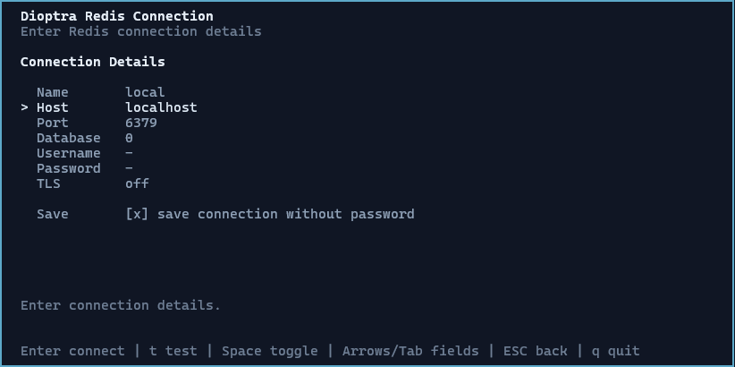
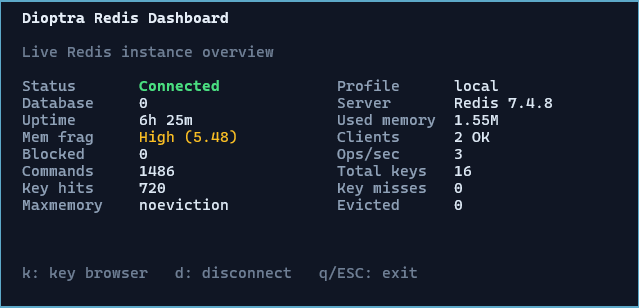
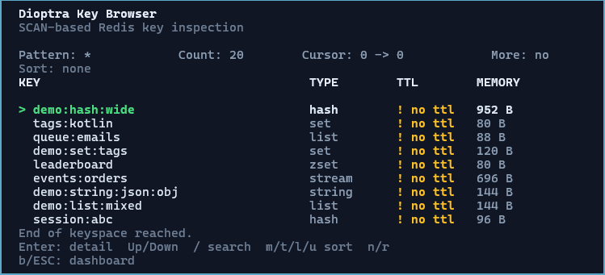

<h1 align="center">Dioptra</h1>

<p align="center">
  A Kotlin terminal UI for inspecting, analyzing, and safely operating Redis databases.<br>
  Connects only to explicitly configured instances, turns raw Redis output into structured views,<br>
  and presents dashboards, key browsing, and type-aware key detail in a focused TUI.
</p>

<p align="center">
  <a href="LICENSE">
    
  </a>
</p>

<p align="center">
  
  
  
  
  
  
  
  
</p>





## What Dioptra Does

Dioptra currently provides a foundation for safe Redis inspection:

- Explicit Redis connection flow through CLI options, saved profiles, or the TUI connection screen
- Redis connection health check with `PING`
- Redis INFO dashboard
- Polished server version display
- Uptime, selected database, and active connection profile display
- Memory usage overview
- Maxmemory policy, eviction count, blocked clients, connected client warnings, and memory fragmentation hints
- Connected client count
- Operations per second
- Key count from Redis keyspace data
- Keyspace hit and miss metrics
- SCAN-based key browser
- Pattern search input
- Cursor-based key pagination
- Selected key navigation
- Type-aware **key detail** for STRING, HASH, LIST, SET, ZSET, and STREAM (metadata, size hints, and value or collection previews)
- **STRING** previews with JSON auto-detection; `v` toggles preview vs raw where supported
- **HASH**, **SET**, and **ZSET** previews via `HSCAN` / `SSCAN` / `ZSCAN` with a capped first page plus **overflow buffering**, so a single large Redis scan reply still paginates correctly in the TUI
- **LIST** and **STREAM** previews via `LRANGE` / `XRANGE` with continuation when more data exists
- **Enter** on the key detail screen loads the next page of collection data when more rows, buffered overflow, or a scan cursor remain
- Cancellable key browser scan loading
- No-TTL visual marker
- Big-key visual marker
- Sort current key browser page by memory, type, or TTL
- Empty, loading, cancelled, end-of-results, and error states for key browsing
- Per-key `TYPE` display
- Per-key `TTL` display
- Per-key `MEMORY USAGE` display
- File-based logging with credential masking
- Debug logging mode
- HOCON connection profiles stored without passwords
- Last-used connection metadata stored without secrets
- Windows development terminal support through Lanterna Swing terminal
- Native terminal rendering on Linux, WSL, and macOS through install distribution scripts

## Project status

Dioptra is **under active development**. It is **not** a stable, versioned product yet: APIs, screens, and behavior can change between commits. Expect **bugs**, incomplete edge cases, or rough UX from time to time.

## Key Features

### Available Now

- Connection screen for saved connections and new connection entry
- Saved Redis profiles in `~/.dioptra/config.conf`
- Last-used connection metadata in `~/.dioptra/last-used.conf`
- CLI connection options:
  - `--url`
  - `--profile`
  - `--host`
  - `--port`
  - `--database`
  - `--username`
  - `--password`
  - `--tls`
  - `--debug`
- Password prompt support through `--password`
- Passwords never saved to profile or last-used metadata files
- Credential-bearing URLs masked in logs and UI-safe rendering
- Redis INFO dashboard
- Polished server version display
- Operations per second metric
- Uptime, selected database, and active connection profile metrics
- Maxmemory policy, eviction count, blocked clients, connected client warning state, and memory fragmentation hint
- SCAN-based key browser
- Pattern search input
- Cursor-based key pagination
- Selected key navigation
- Type-aware key detail for STRING, HASH, LIST, SET, ZSET, and STREAM (previews, sizes, paginated collections)
- STRING JSON auto-detection and raw/preview toggle (`v`)
- HASH / SET / ZSET scan previews with overflow-backed pagination; LIST / STREAM range-based pagination
- **Enter** on key detail loads the next collection page when applicable
- Cancellable key browser scan loading
- No-TTL visual marker
- Big-key visual marker
- Sort current key browser page by memory, type, or TTL
- Empty, loading, cancelled, end-of-results, and error states for key browsing
- Display key type
- Display key TTL
- Display key memory usage
- Dashboard disconnect flow back to the connection screen
- Reusable TUI theme and components
- Terminal backend selection for Windows, Linux, WSL, and macOS

### Planned For v0.1

- Slowlog viewer
- Basic namespace summary
- Safe delete with confirmation
- Expire key action
- Further key-detail polish (editing values, richer formatting, edge-case hardening)

### Planned For Later Versions

- Deeper dashboard metrics and warnings beyond the current Redis INFO overview
- Namespace analysis with TTL coverage, memory concentration, health scoring, and risky namespace detection
- Big key and no-TTL analysis with top-N views and risk markers
- Slowlog and production debugging screens with repeated slow command grouping and suspicious command warnings
- Safer operations including read-only mode, production safety mode, protected namespace rules, dry-run previews, and operation audit logs
- Markdown report export, session summaries, analysis snapshots, and before/after comparison
- Advanced Redis workflows such as Pub/Sub monitor, stream consumer group inspection, stream lag warnings, and MONITOR-based live command feed
- Environment workflow helpers such as Docker Compose detection, SSH tunnel profiles, profile import/export, and team-shareable profile templates without secrets
- Optional connection pool if concurrent analysis or monitoring workflows require it
- Optional AI-assisted analysis after deterministic reports are available, including local-first health summaries, namespace risk explanations, cleanup plan narration, and "what should I inspect next?" recommendations
- Optional semantic cache inspection using embedding providers, with `redis/langcache-embed-v3-small` as a possible local embedding model candidate
- GraalVM native-image distribution

## Connection Configuration

Dioptra does not scan ports or networks automatically. Connections are explicit and user-controlled.

Connection priority:

1. `--url`
2. `--profile`
3. Individual CLI options such as `--host`, `--port`, `--database`, `--username`, `--tls`
4. Default profile from `~/.dioptra/config.conf`
5. TUI connection screen

Example CLI usage:

```bash
dioptra --url redis://localhost:6379/0
dioptra --profile local
dioptra --host localhost --port 6379
dioptra --host redis.example.com --port 6380 --tls
dioptra --profile staging --password
```

Profile config path:

```text
~/.dioptra/config.conf
```

Example profile config:

```hocon
defaultProfile = "local"

profiles = [
  {
    name = "local"
    host = "localhost"
    port = 6379
    database = 0
    tls = false
    timeoutMillis = 5000
    requiresPassword = false
  },
  {
    name = "staging"
    host = "redis.staging.example.com"
    port = 6380
    database = 0
    username = "default"
    tls = true
    timeoutMillis = 5000
    requiresPassword = true
  }
]
```

Last-used metadata path:

```text
~/.dioptra/last-used.conf
```

Allowed last-used metadata:

- Profile name
- Host
- Port
- Database
- Username
- TLS flag
- Last connected timestamp

Not stored:

- Password
- Full URL containing credentials

## Tech Stack

| Layer | Technology |
|---|---|
| Language | Kotlin/JVM |
| Build | Gradle |
| Redis client | Lettuce |
| CLI parser | Clikt |
| TUI rendering | Lanterna |
| Concurrency | Kotlin Coroutines |
| Logging | SLF4J and Logback |
| Configuration | HOCON / Typesafe Config |
| Testing | Planned Kotest and Testcontainers Redis |

## Project Folder Structure

Current high-level structure:

```text
dioptra
├── app
│   ├── src
│   │   └── main
│   │       ├── kotlin
│   │       │   └── io.github.eyuppastirmaci.dioptra
│   │       │       ├── application
│   │       │       ├── bootstrap
│   │       │       ├── cli
│   │       │       ├── concurrency
│   │       │       ├── config
│   │       │       ├── domain
│   │       │       ├── infrastructure
│   │       │       ├── logging
│   │       │       └── presentation
│   │       └── resources
│   └── build.gradle.kts
├── buildSrc
├── gradle
├── utils
├── settings.gradle.kts
├── gradlew
├── gradlew.bat
└── README.md
```

## Requirements

- JDK 25
- Docker Desktop or any reachable Redis instance
- Gradle Wrapper included in the project
- Windows Terminal, WSL, Linux terminal, or macOS terminal for native TUI testing

## Running Redis Locally With Docker

Start a local Redis instance:

```bash
docker run --name dioptra-redis -p 6379:6379 -d redis:7-alpine
```

Verify Redis:

```bash
docker exec -it dioptra-redis redis-cli ping
```

Expected output:

```text
PONG
```

Add sample data:

```bash
docker exec -it dioptra-redis redis-cli
```

Then inside `redis-cli`:

```redis
SET user:1 "{\"id\":1,\"name\":\"John\"}"
EXPIRE user:1 3600

HSET session:abc userId 1 status active
LPUSH queue:emails job1 job2 job3
SADD tags:kotlin redis tui cli
ZADD leaderboard 100 john 80 ali
XADD events:orders * type created orderId 123
```

Exit Redis CLI:

```redis
exit
```

## Build

### Windows

```powershell
.\gradlew.bat :app:build
```

### Linux, WSL, macOS

```bash
./gradlew :app:build
```

## Run During Development

### Windows Development Mode

On Windows, Lanterna may open a Swing-based terminal window during development. This is the most stable development mode on Windows.

```powershell
.\gradlew.bat :app:run
```

### Linux, WSL, macOS Development Mode

For native terminal rendering, prefer the application distribution script instead of Gradle `run`.

```bash
./gradlew :app:installDist
./app/build/install/app/bin/app
```

This avoids TTY issues that can happen when running a terminal UI through Gradle's `run` task.

## WSL Test Workflow From Windows

If the main project is edited from Windows and native terminal rendering needs to be tested in WSL, sync the project into the Linux filesystem first:

```bash
rsync -a \
  --exclude .gradle \
  --exclude build \
  --exclude .idea \
  --exclude '**/build' \
  /mnt/c/Users/<windows-user>/IdeaProjects/dioptra/ \
  ~/projects/dioptra/
```

Then run:

```bash
cd ~/projects/dioptra
./gradlew :app:installDist
./app/build/install/app/bin/app
```

## Build A Runnable Distribution

Create an installable distribution.

### Windows

```powershell
.\gradlew.bat :app:installDist
```

Run the generated script:

```powershell
.\app\build\install\app\bin\app.bat
```

### Linux, WSL, macOS

```bash
./gradlew :app:installDist
```

Run the generated script:

```bash
./app/build/install/app/bin/app
```

## Logging

Dioptra uses file-based logging because stdout and stderr can break the terminal UI.

Default log path:

```text
~/.dioptra/logs/dioptra.log
```

Debug log path:

```text
~/.dioptra/logs/dioptra-debug.log
```

Enable debug logging:

```bash
dioptra --debug
```

On Windows, these paths usually map to:

```text
C:\Users\<user>\.dioptra\logs\
```

## Current Keyboard Shortcuts

### Connection Screen

Saved connection list:

| Key | Action |
|---|---|
| `Enter` | Connect to selected saved connection |
| `n` | Open new connection form |
| `d` | Delete selected saved connection |
| `Up/Down` | Select saved connection |
| `q` / `ESC` | Exit |

Connection form:

| Key | Action |
|---|---|
| `Enter` | Connect |
| `t` | Test connection |
| `Space` | Toggle TLS or save checkbox |
| `ArrowUp/ArrowDown/Tab` | Move between fields |
| `ESC` | Back to saved connection list, when saved connections exist |
| `q` | Exit |

### Dashboard

| Key | Action |
|---|---|
| `k` | Open key browser |
| `d` | Disconnect and return to connection screen |
| `q` | Exit |
| `ESC` | Exit |

### Key Browser

| Key | Action |
|---|---|
| `/` | Edit key search pattern |
| `Up/Down` | Move selected key |
| `Enter` | Open selected key detail |
| `m` | Sort current page by memory descending |
| `t` | Sort current page by type ascending |
| `l` | Sort current page by TTL ascending |
| `u` | Clear current page sort |
| `n` | Load next SCAN page |
| `r` | Refresh from cursor `0` |
| `b` | Return to dashboard |
| `ESC` | Cancel active scan while loading, otherwise return to dashboard |
| `q` | Exit |

Pattern search mode:

| Key | Action |
|---|---|
| `Enter` | Apply pattern and rescan from cursor `0` |
| `Backspace` | Delete previous character |
| `ESC` | Cancel pattern edit |

### Key Detail

Shown after opening a key from the key browser (`Enter` on a key). Shortcuts can vary slightly by key type (collections show a "next page" hint when more data is available).

| Key | Action |
|---|---|
| `↑` / `↓` | Move selection within the value or collection preview |
| `Enter` | Load the next page of collection data when HASH, LIST, SET, ZSET, or STREAM previews have more to show |
| `v` | Toggle value presentation (e.g. STRING preview vs raw / pretty JSON where supported) |
| `b` / `ESC` | Return to the key browser |
| `q` | Exit the application |

## License

This project is licensed under the MIT License.
